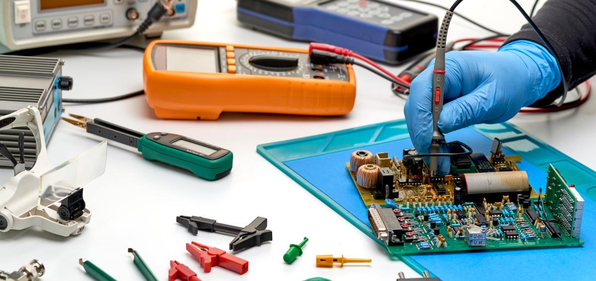
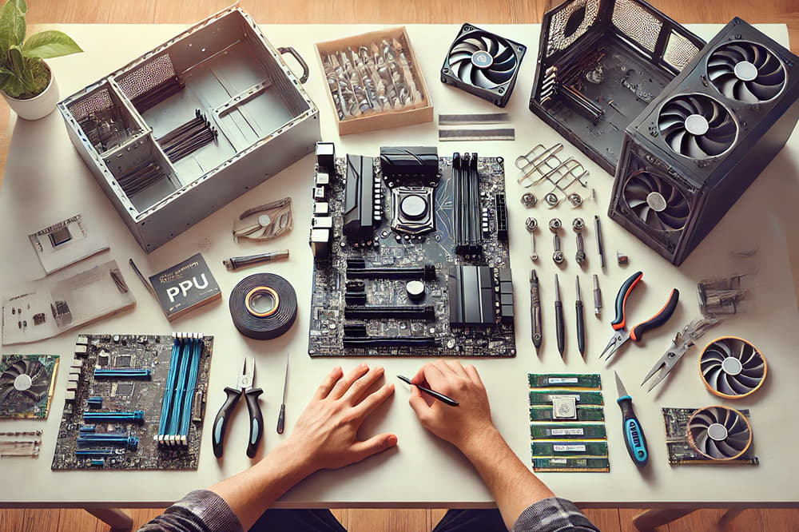

# Introducción a la Electrónica y el Hardware

La electrónica es una rama fundamental de la ingeniería que se encarga del estudio y aplicación de dispositivos que controlan el flujo de corriente eléctrica. Está presente en prácticamente todos los sistemas modernos, desde ordenadores y teléfonos móviles hasta sistemas industriales y dispositivos médicos.

El hardware, por su parte, hace referencia al conjunto de componentes físicos que conforman un sistema electrónico o informático.

# Componentes Electrónicos Básicos

- Los componentes electrónicos son los elementos fundamentales que permiten construir circuitos. Algunos de los más comunes son:

- Resistencias: limitan o regulan el paso de corriente.

- Condensadores: almacenan energía eléctrica temporalmente.

- Diodos: permiten el paso de corriente en un solo sentido.

- Transistores: actúan como interruptores o amplificadores de señal.

- Estos componentes se combinan para formar circuitos capaces de realizar tareas específicas.

## 🖼️ COMPONENTES ESENCIALES

# Hardware y Arquitectura de un Sistema

El hardware de un sistema informático está compuesto por distintos elementos que trabajan de forma conjunta:

- Procesador (CPU): ejecuta las instrucciones del sistema.

- Memoria RAM: almacena datos temporales durante la ejecución.

- Placa base (Motherboard): conecta y comunica todos los componentes.

- Almacenamiento: discos duros o unidades SSD para datos persistentes.

- Cada uno de estos componentes influye directamente en el rendimiento y capacidades del sistema.

-> Importancia del Control de Documentación Técnica <-

## 🖼️ COMPONENTES DE UN ORDENADOR

# Enlace acerca de más información

[📚 Ver más información](https://es.wikipedia.org/wiki/Electr%C3%B3nica)

# Enlaces acerca de componentes que uno puede comprar y que les pueda servir para armar su PC.

[📚 Link de componentes 1](https://www.mcr.com.es/buscar-categoria/componentes-integracion)

[📚 Link de componentes 2](https://www.pccomponentes.com/componentes).